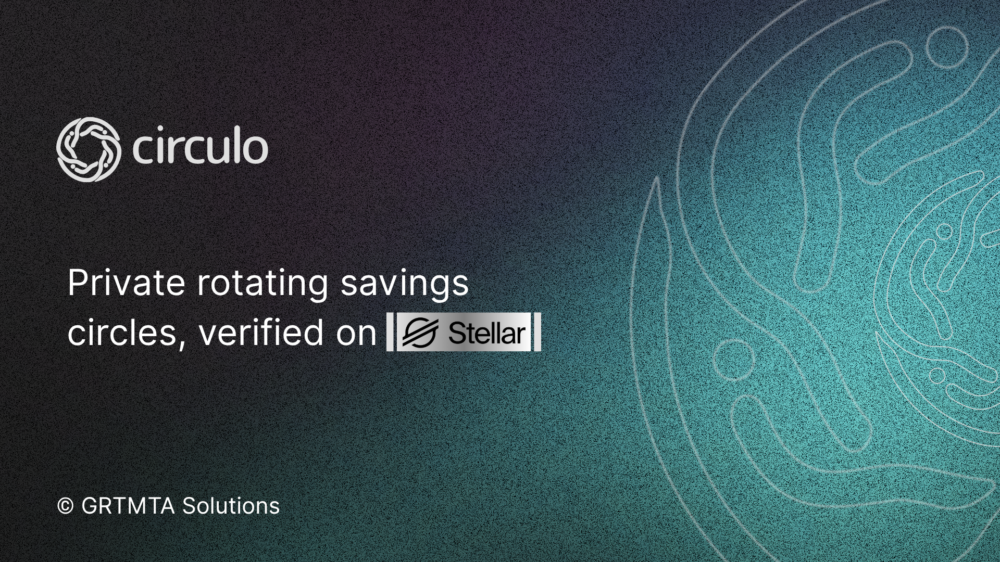

<p align="center">
  
</p>

<h1 align="center">Circulo</h1>

<p align="center">
  <strong>Trust-Based Rotating Savings Circles on Stellar</strong>
</p>

<p align="center">
  <a href="https://circulo-eta.vercel.app/" target="_blank">
    
  </a>
</p>

---

## Overview

**Circulo** is a non-custodial, invite-only rotating savings circle (ROSCA) for trusted groups. Members contribute a fixed stablecoin amount on a scheduled basis, and each round, one member receives the full pool. A Soroban smart contract enforces collateral rules to protect against missed contributions.

Built on **Stellar**, Circulo leverages blockchain transparency and smart contract enforcement to make traditional savings circles more trustworthy, efficient, and accessible.

---

## Features

- **Non-Custodial** — Funds are held by a Soroban smart contract, not a centralized party
- **Collateral Enforcement** — Members post collateral that backs their future contributions
- **Fair Payout Rotation** — On-chain logic determines the payout order transparently
- **Unanimous Dissolution** — All members must agree to dissolve an active circle
- **Slash Protection** — Defaulting members can have their collateral slashed to cover missed payments
- **Multi-Cycle Support** — Circles can run multiple rotations (up to 12 cycles)
- **Real-Time Tracking** — Dashboard to monitor contributions, rounds, and payouts

---

## Tech Stack

| Layer | Technologies |
|-------|--------------|
| **Frontend** | Next.js 16, React 19, Tailwind CSS |
| **Blockchain** | Stellar, Soroban Smart Contracts |
| **Wallet** | Stellar Wallets Kit, `@stellar/stellar-sdk` |
| **Smart Contract** | Rust, `soroban-sdk` |
| **Backend** | Next.js Route Handlers, Serverless Cron Jobs |
| **Database** | Supabase |
| **Deployment** | Vercel (App/API), Stellar Network (Contract) |

---

## Getting Started

### Prerequisites

- Node.js 18+
- npm or yarn
- Stellar wallet (e.g., Freighter)
- Supabase account
- Stellar CLI (for contract development)

### Installation

```bash
# Clone the repository
git clone https://github.com/Nesqyk/circulo.git

# Install dependencies
npm install

# Start development server
npm run dev
```

Open [http://localhost:3000](http://localhost:3000) to view the app.

### Environment Setup

Copy `.env.example` to `.env.local` and configure:

- Supabase credentials
- Soroban RPC endpoint
- Deployed contract ID
- SEP-24 anchor settings

---

## Useful Scripts

| Command | Description |
|---------|-------------|
| `npm run dev` | Start Next.js development server |
| `npm run build` | Build the application |
| `npm run lint` | Run ESLint |
| `npm run typecheck` | Run TypeScript type checking |
| `npm run contract:test` | Run Soroban contract tests |
| `npm run contract:build` | Build Soroban contract with Stellar CLI |
| `npm run storybook` | Start Storybook component library |

---

## Smart Contract

The Circulo smart contract handles:

- Circle initialization and activation
- Collateral posting and management
- Contribution tracking per round
- Payout execution with fair rotation
- Dissolution proposals and voting
- Collateral slashing for defaults
- Fair distribution on completion or dissolution

Located in `contracts/circulo/` with comprehensive test coverage.

---

## Our Team

Circulo was built by a team of passionate engineers and designers:

| Name | Role |
|------|------|
| **John Vincent Augusto** | Full-stack Engineer |
| **Mikaela Molina** | Product Marketing Engineer |
| **Tyrone Tabornal** | Design Engineer |
| **Joanne Georfo** | Frontend Developer |
| **Jontheym Remegia** | Backend Engineer |

---

## License

MIT License — feel free to use, modify, and distribute.

---

<p align="center">
  <a href="https://circulo-eta.vercel.app/">Try Circulo Live</a> • 
  <a href="https://github.com/Nesqyk/circulo/issues">Report Bug</a> • 
  <a href="https://github.com/Nesqyk/circulo/issues">Request Feature</a>
</p>
